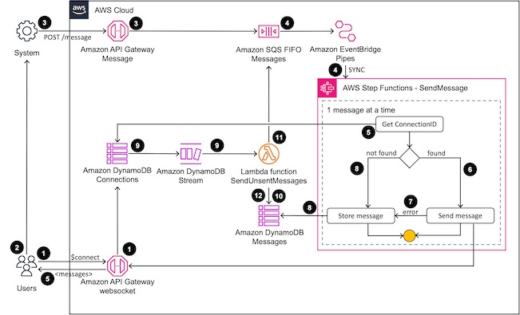

# serverless-async-messaging-gateway

Serverless gateway to manage asynchronous messages, responses, and notifications
typically produced by long running tasks, implemented using a CDK project.

This gateway receives the messages from other components of your system and it
sends the messages to the clients through WebSockets. The gateway also holds the
messages, if there is any delivery issue, to send them when the client
reconnects.

This solutions has three components:

* The messaging gateway

  `lib/gateway.ts` - the gateway construct

  `assets/*.asl` - the AWS Step Function workflows

* The authentication component

  `lib/authentication.ts` - the authentication construct

  `lib/authentication.Generator.mjs` - the temporary token generator AWS Lambda
  function implementation

  `lib/authentication.Authorizer.mjs` - the AWS Lambda authorizer 

* A sample application to simulate a long running async task 

  `lib/application.ts` - the sample application construct

  `lib/application.sample.cjs` - the sample application AWS Lambda function

## Messaging gateway



1\) The user connects to the websocket to establish a communication path to
receive the messages. The connection is validated using a single use temporary
token using the Lambda authorizer provided by the Authentication component (see
the Authentication component). When the user is connected, the user ID and the
connection ID are stored at the Connections table.

2\) The user interacts with a system that gives asynchronous responses or
notifications.

3\) The system produces a result or notification which is sent to the Messaging 
gateway through the _Message_ API Gateway. The authorization is validated
through AWS Identity and Access Management (IAM). The API Gateway starts the
_SendMessage_ Step Function to try to deliver the message.

4\) The workflow retrieves the connection ID for the destination user.

5\) If the connection ID is found, the workflow tries to send the the message to
the user. If it is successful, the workflow finishes here.

6\) If there is any error, the message goes to the store message step.

7\) If the connection ID is not found or there is any error, the message is
stored at the _Messages_ table to be delivered when the user reconnects.

8\) When the users connects (step 1), the connection ID is stored at the
_Connections_ table. Throught DynamoDB streams, a EventBridge pipe gets the 
event and starts the _SendUnsentMessages_ Step Function.

9\) The workflow retrieves the pending messages for the user.

10\) For each message, the workflow starts the _SendMessage_ Step Function,
which goes through the step 4 to 7 for the message.

11\) The message is deleted from the _Messages_ table.

12\) If there is more messages to read for the user, the steps 9 to 11 is
repeated.

## Authentication component


1\) The users authenticate at an Cognito user pool to get an ID token.

2\) To authenticate at the messages WebSocket, the users request a single use 
temporary token passing the ID token at the Authorization header.

3\) The API Gateway validates the ID token at the Cognito user pool.

4\) API Gateway invokes the Lambda function to generate the single use temporary
token.

5\) The _Generator_ Lambda function creates a JSON token with the issuer and 
audience being the authentication service, the subject iwiths the user ID, the 
username with the preferred username, and the token expires after 30 seconds
This token is encrypt using a KMS key.

6\) The encrypted token in base64 is stored at the _TempKeys_ DynamoDB table
with a ttl attribute with the token expiration value.

7\) The user connects to the messages WebSocket passing the single use temporary 
token at the query string “token”. The API Gateway invokes the Lambda authorizer 
to validate the token. The Lambda authorizer deletes the token from the
_TempKeys_ table requesting to return the old record: if the returned record is
empty, the access is denied.

8\) The Lambda authorizer decrypts the single use temporary token and validates 
the issuer, audience, and expiration. If there isn't any problem, the Lambda
authorizer returns a policy authorizing the connections with the principal as 
the user ID and the username at the context.

## Deployment and tests

The deployment was tested with Node.js 18 and AWS Cloud Development Kit (CDK)
v2.

### Deployment

```sh
npm install
cdk deploy
```

### Testing

To test, you will use a Node.js script (`bin/msg.mjs`). Follow these steps:

1. Create a user at the Cognito user pool while defining ther user's password:
   
   `node bin/msg.mjs create-user -p <password>`

2. Authenticate the user:

   ``eval `node bin/msg.mjs auth -p <password>` ``

   Copy the generated ID token.

3. Connect to the messages WebSocket:

   `node bin/msg.mjs connect-websocket`

4. In a new terminal, send a message running:

   `export ID_TOKEN="<the ID token from step 2>"`

   `node bin/msg.mjs send-message "Serverless is cool!" -w 20`

5. Stop the WebSocket connection created at step 3.

6. Send 3 to 5 different messages as you did in step 4.

7. Reconnect the WebSocket as you did in step 3 and check if you received the
   messages that were sent in step 6.

### Clean up
Run:

```sh
cdk destroy
```

To remove the logs, access the CloudWatch Logs console and delete the logs that
starts with _ServerlessAsyncMessaging_. 

## Security

See [CONTRIBUTING](CONTRIBUTING.md#security-issue-notifications) for more information.

## License

This library is licensed under the MIT-0 License. See the LICENSE file.
